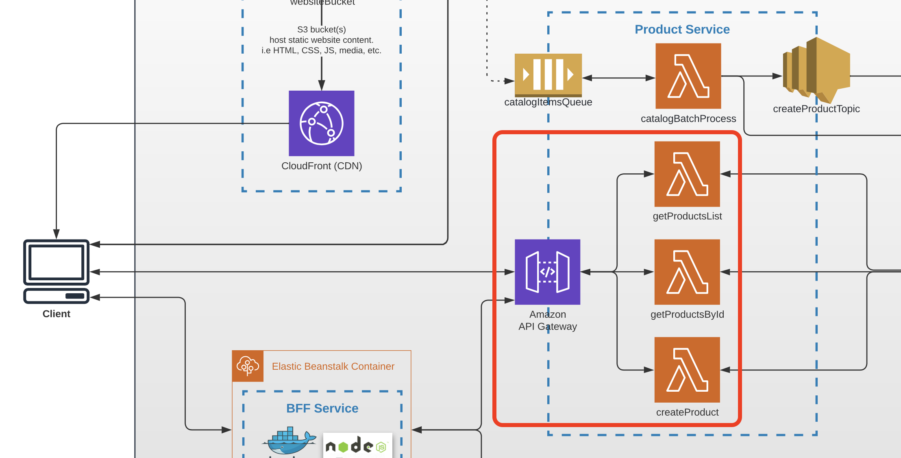

# Task 3 (First API with AWS API Gateway and AWS Lambda)

## Prerequisites

---

- **Install** the latest version of AWS CDK (https://docs.aws.amazon.com/cdk/v2/guide/getting_started.html).
- **Configure** credentials for AWS to make them accessible by AWS CLI & CDK.
- **Create** your **own public GitHub repository** for all future backend work. You will have 2 repos — 1 for frontend and 1 for backend for the rest of the course.

The desired backend working tree should look like this:

```
backend
├── point_service         <- point service (this module)
├── import_service        <- import service (module 5+)
└── authorization_service <- authorization service (module 7+)
```

_NOTE: Create a branch from `main` and work in that branch (e.g. `task-3`) in both the BE and FE repositories._

_NOTE: Don't forget to integrate the map points list with the FE app._

_NOTE: This service must be created using AWS CDK, AWS API Gateway, and AWS Lambda._

## Architecture

Find the entire program architecture: [here](../Architecture.pdf).

<details>
  <summary>Task Focus</summary>

  The following image provides more info about task focus.

  

</details>

## Data model

A **map point** has the following shape (mock data for this module):

```json
{
  "id": "uuid",
  "title": "string",
  "description": "string",
  "latitude": "number",
  "longitude": "number"
}
```

## Module Feature Flags

For this module, update your frontend flags and check off:

- [ ] `module=3`
- [ ] `api.enablePointsApi=true`
- [ ] `api.pointsSource=mock`
- [ ] Keep `ui.enableCreatePoint=false`
- [ ] Keep upload/import/auth/AI flags disabled

## Node.js Contract (Required)

Implement this module in the Node.js backend track:

- [ ] Node.js handler files are created and wired in CDK.
- [ ] `GET /points` and `GET /points/{pointId}` return stable status codes and JSON fields.
- [ ] Not found behavior is handled as `404` with consistent error field names.

## Tasks

---

### Task 3.1

1. Create a lambda function called `getPointsList` inside a new `point-service` CDK stack, triggered by `GET /points`.
2. The response should be a _full_ array of map points (use **mock data** stored in the Point Service — at least 5 sample points with realistic coordinates).
3. Integrate this endpoint with the Frontend app so that map points are displayed on the map.

> **Node.js hint:** export the handler from a dedicated `handlers/getPointsList.js` file.

### Task 3.2

1. Create a lambda function called `getPointById` in the same CDK stack, triggered by `GET /points/{pointId}`.
2. The response should return a single map point matching `pointId` from the mock data array.
3. Return HTTP 404 with a descriptive message if the point is not found.

### Task 3.3

1. Commit all your work to a separate branch (e.g. `task-3` from the latest `main`) in your own repository.
2. Create a pull request to the `main` branch.
3. Submit the link to the pull request in the Crosscheck page in [RS App](https://app.rs.school).
4. Update frontend `.env.local` with:

  - `VITE_POINTS_API_URL={your-api-gateway-base-url}`

  Example:

  - `VITE_POINTS_API_URL=https://abc123.execute-api.eu-central-1.amazonaws.com/prod`

Current deployed example in this workspace:

  - `VITE_POINTS_API_URL=https://96ak46xqqf.execute-api.eu-central-1.amazonaws.com/prod`

## Evaluation criteria (70 points for covering all criteria)

---

Reviewers should verify the lambda functions by invoking them through the provided URLs.

- Point Service CDK stack contains configuration for 2 lambda functions; API may not work fully, but configuration is correct.
- The `getPointsList` OR `getPointById` lambda function returns a correct response (POINT1).
- Both `getPointsList` AND `getPointById` lambda functions return correct response codes (POINT2).
- The Frontend application is integrated with the Point Service (`/points` API) and points from the Point Service are shown on the map. AND POINT1 and POINT2 are done.

## Additional (optional) tasks

---

- **+7.5** **(All languages)** — Swagger documentation is created for Point Service (`openapi.json` or `openapi.yaml`), renderable at https://editor.swagger.io/
- **+7.5** **(All languages)** — Lambda handlers are covered by basic unit tests (no infrastructure logic required).
- **+7.5** **(All languages)** — Lambda handlers (`getPointsList`, `getPointById`) are split into separate files/modules.
- **+7.5** **(All languages)** — Main error scenarios handled by the API ("Point not found" — 404; unexpected errors — 500).

## Description Template for PRs

---

The following should be present in the PR description:

1. What was done?

   Example:

```
   Service is done, FE integration works.

   Additional scope: swagger, unit tests
```

2. Link to Point Service API — .....
3. Link to FE PR (YOUR OWN REPOSITORY) — ...

4. If Swagger is not provided — include the point schema in the PR description.

Acceptance template:

- [acceptance_test_templates/module_03_points_api.http](../acceptance_test_templates/module_03_points_api.http)
