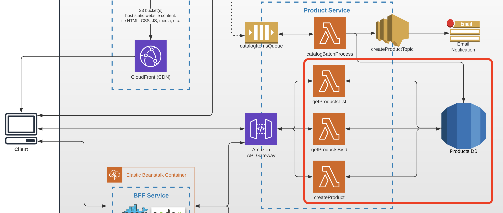

# Task 4 (Integration with NoSQL Database)

## Architecture

Find the entire program architecture: [here](../Architecture.pdf).

<details>
  <summary>Task Focus</summary>

  The following image provides more info about task focus.

  

</details>

## Data model

Replace mock data from module 3 with the following DynamoDB table.

**points** table:

```
id          - uuid (Partition key)
title       - string, not null
description - string
latitude    - number, not null
longitude   - number, not null
createdAt   - string (ISO timestamp)
tags        - string list (optional)
photoUrl    - string (optional, added in module 5)
```

## Module Feature Flags

For this module, update your frontend flags and check off:

- [ ] `module=4`
- [ ] `api.pointsSource=dynamodb`
- [ ] `ui.enableCreatePoint=true`
- [ ] Keep upload/import/auth/AI flags disabled

## Node.js Implementation Track (Required)

- [ ] Use AWS SDK v3 DynamoDB client and implement `getPointsList`, `getPointById`, and `createPoint`.
- [ ] Use one DynamoDB table with consistent key names and response JSON.
- [ ] `createPoint` must persist all point attributes in a single write operation.

Reference snippets:

- [starter_app_templates/backend_node/module_snippets.ts](../starter_app_templates/backend_node/module_snippets.ts)

## Tasks

---

### Task 4.1

1. Use the AWS Console to create the DynamoDB table described above with on-demand (PAY_PER_REQUEST) billing to stay within the free tier.
2. Write a seed script to populate the table with at least 5 test points. Store the script in your repository and execute it.
3. Provide a Node.js seed script (AWS SDK v3).

### Task 4.2

1. Extend your CDK stack with the DynamoDB table ARN and pass it to Lambda environment variables.
2. Update the `getPointsList` lambda to return the full list of points from DynamoDB.
3. The frontend should display the point model, for example:

```json
{
  "id": "19ba3d6a-f8ed-491b-a192-0a33b71b38c4",
  "title": "Eiffel Tower",
  "description": "Iconic iron lattice tower in Paris.",
  "latitude": 48.8584,
  "longitude": 2.2945,
  "createdAt": "2025-01-15T10:00:00Z",
  "tags": ["landmark", "paris"]
}
```

4. Update the `getPointById` lambda to return a single point from DynamoDB.

### Task 4.3

1. Create a lambda function called `createPoint` in the Point Service CDK stack, triggered by `POST /points`.
2. It should write a new record to the **points** table in DynamoDB.
3. The request body should contain `title`, `description`, `latitude`, and `longitude`.
4. Save your API Gateway URL for the PR description.

### Task 4.4

1. Commit all your work to a separate branch (e.g. `task-4`) in your BE repository and, if needed, your FE repository.
2. Create a pull request to the `main` branch.
3. Submit the link to the pull request in the Crosscheck page in [RS App](https://app.rs.school).
4. Update frontend `.env.local` to point to your module 4 API Gateway URL:

  - `VITE_POINTS_API_URL={your-module-4-api-url}`

  Current deployed example in this workspace:

  - `VITE_POINTS_API_URL=https://afet1o3gl2.execute-api.eu-central-1.amazonaws.com/prod`

## Evaluation criteria (70 points for covering all criteria)

---

Reviewers should verify the lambda functions by invoking them through the provided URLs.

- Task 4.1 is implemented (DynamoDB table created and seeded).
- Task 4.2 is implemented; lambda URLs are provided and return data from DynamoDB.
- Task 4.3 is implemented; `POST /points` creates a point in DynamoDB (verify with GET /points).
- The Frontend shows points from DynamoDB (not mock data). Link to a working frontend is provided.

## Additional (optional) tasks

---

- **+7.5** — `POST /points` returns 400 if required fields are missing or invalid.
- **+7.5** — All lambdas return 500 on unexpected errors (DB connection failure, unhandled exceptions).
- **+7.5** — All lambdas log each incoming request and arguments via `console.log`.
- **+7.5** **(All languages)** — `POST /points` persists `createdAt` and returns the created record in the response body.

## Penalties

---

- **-50** — Serverless Framework used to create and deploy infrastructure.

## Description Template for PRs

---

1. What was done?

2. Link to Point Service API — .....
3. Link to FE PR (YOUR OWN REPOSITORY) — ...
4. Example `curl` to create a point — ...

Acceptance template:

- [acceptance_test_templates/module_04_points_db.http](../acceptance_test_templates/module_04_points_db.http)
