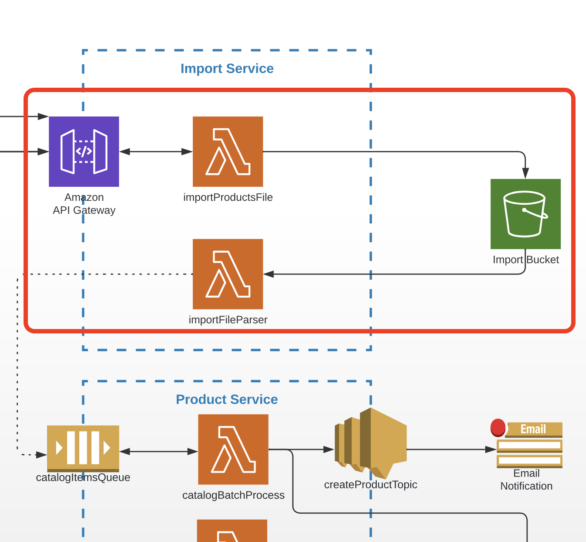

# Task 5 (Integration with S3)

## Prerequisites

---

- The task is a continuation of module 4 and should be done in the same repos.
- **(Node.js)** Install the latest version of [AWS SDK v3](https://docs.aws.amazon.com/sdk-for-javascript/v3/developer-guide/getting-started-nodejs.html).
- **(Node.js)** Install the [csv-parser](https://www.npmjs.com/package/csv-parser) package.

## Architecture

Find the entire program architecture: [here](../Architecture.pdf).

<details>
  <summary>Task Focus</summary>

  The following image provides more info about task focus.

  

</details>

## Module Feature Flags

For this module, update your frontend flags and check off:

- [ ] `module=5`
- [ ] `ui.enableUploadPhoto=true`
- [ ] `ui.enableCsvImport=true`
- [ ] Keep auth and AI flags disabled

## Node.js Implementation Track (Required)

- [ ] Implement presigned URLs, S3 triggers, and CSV parsing in `import-service`.
- [ ] Keep S3 object key conventions stable (`uploads/{pointId}/{fileName}`, `uploaded/{fileName}`, `parsed/{fileName}`).
- [ ] Keep API and error response format consistent.

## Tasks

---

### Task 5.1

1. Create a new service called `import-service` at the same level as the Point Service with its own CDK stack.

```
backend
├── point_service
└── import_service   <- new
```

2. In the AWS Console, create and configure a new S3 bucket with a folder called `uploads`.

### Task 5.2 — Photo upload via presigned URL

1. Create a lambda function called `getUploadUrl` in the Import Service CDK stack, triggered by `GET /upload`.
2. The function should accept a `fileName` query parameter and return a presigned S3 `PUT` URL for the key `uploads/{pointId}/{fileName}`.
   - Also accept a `pointId` query string parameter so photos are scoped to a specific point.
3. The presigned URL should expire in 5 minutes.
4. Update the CDK stack with IAM policies allowing the lambda to generate presigned URLs for the S3 bucket.
5. Integrate the frontend: the "Upload Photo" button should call `GET /upload?pointId=...&fileName=...`, then `PUT` the file directly to S3 using the presigned URL.
6. Use presigned URLs with expiration time `300` seconds.

Add the deployed import API URL to frontend local env before testing UI:

```bash
# starter_app_templates/frontend/.env.local
VITE_IMPORT_API_URL=https://gbd1fz112a.execute-api.eu-central-1.amazonaws.com/prod
```

### Task 5.3 — S3 event trigger

1. Create a lambda function called `processUploadedPhoto` in the Import Service CDK stack, triggered by the `s3:ObjectCreated:*` event on the `uploads/` prefix.
2. The lambda should:
   - Parse the `pointId` from the S3 key (e.g. `uploads/{pointId}/{fileName}`).
   - Update the corresponding DynamoDB `points` record with the `photoUrl` field (the S3 object URL or a CloudFront URL if configured).
   - Log the record details to CloudWatch.

### Task 5.4 — CSV bulk import

1. Create a lambda function called `importPointsFile` in the Import Service CDK stack, triggered by `GET /import`.
2. The function should accept a `fileName` query parameter and return a presigned S3 `PUT` URL for the key `uploaded/{fileName}` where `fileName` is a `.csv` file.
3. Create a lambda function called `importFileParser` triggered by `s3:ObjectCreated:*` on the `uploaded/` prefix.
4. The parser should read the CSV using a readable stream, log each record to CloudWatch, and move the file from `uploaded/` to `parsed/` when done.
5. Ensure the parser publishes this record shape for downstream queue processing:

   - `{ "title": string, "description": string, "latitude": number, "longitude": number }`

Expected CSV format:

```
title,description,latitude,longitude
Eiffel Tower,Iconic iron lattice tower,48.8584,2.2945
```

### Task 5.5

1. Commit all your work to a separate branch (e.g. `task-5`) in your own repository.
2. Create a pull request to the `main` branch.
3. Submit the link to the pull request in the Crosscheck page in [RS App](https://app.rs.school).

## Evaluation criteria (70 points for covering all criteria)

---

- CDK stack contains configuration for `getUploadUrl` function.
- `getUploadUrl` returns a valid presigned URL that can be used to upload a file to S3.
- Frontend is integrated with `getUploadUrl`; uploaded photo URL is stored in DynamoDB.
- `importPointsFile` and `importFileParser` are implemented and configured in the CDK stack.

## Additional (optional) tasks

---

- **+10** — `getUploadUrl` lambda is covered by unit tests (mock S3 SDK calls).
- **+10** — `importFileParser` lambda is covered by unit tests.
- **+10** — At the end of the stream `importFileParser` moves the file from `uploaded/` to `parsed/` (copy then delete).

## Penalties

---

- **-50** — Serverless Framework used to create and deploy infrastructure.

## Description Template for PRs

---

1. What was done?

2. Link to Import Service API — .....
3. Link to FE PR (YOUR OWN REPOSITORY) — ...

Acceptance template:

- [acceptance_test_templates/module_05_upload_import.http](../acceptance_test_templates/module_05_upload_import.http)

Deployed example for this workspace:

- Import API: `https://gbd1fz112a.execute-api.eu-central-1.amazonaws.com/prod`
