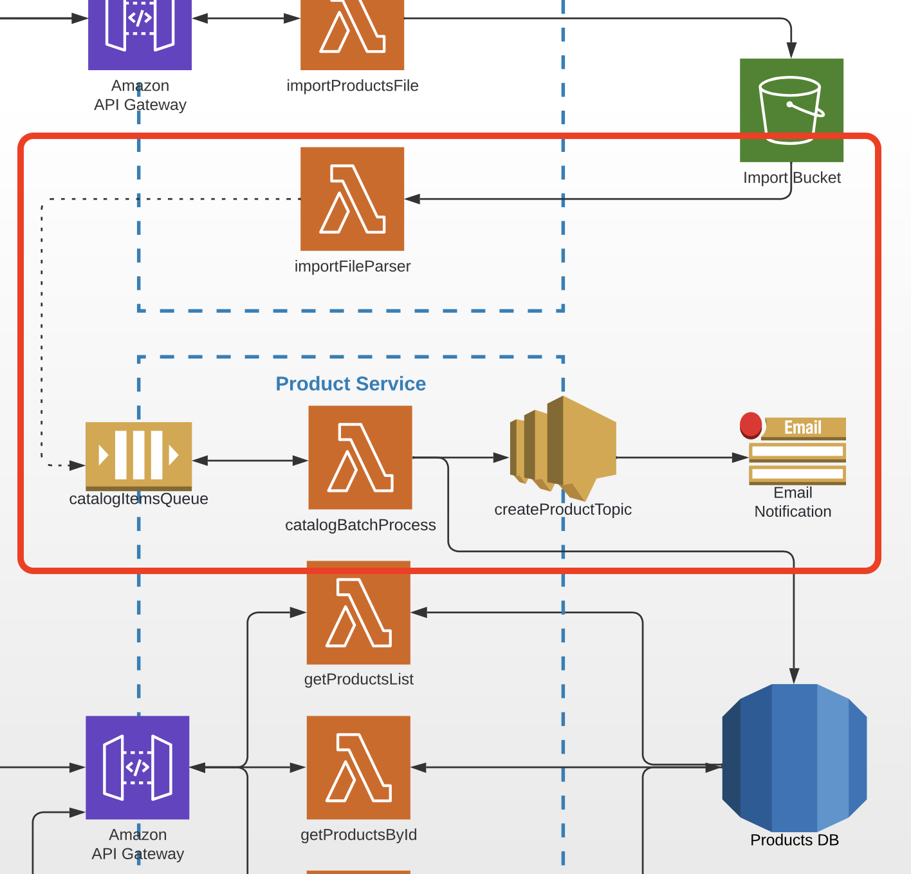

# Task 6 (SQS & SNS — Async Microservices Communication)

## Prerequisites

---

- The task is a continuation of module 5 and should be done in the same repos.
- Goal: process bulk CSV point imports asynchronously so large files do not block the Lambda execution timeout and individual point failures are isolated.

## Architecture

Find the entire program architecture: [here](../Architecture.pdf).

<details>
  <summary>Task Focus</summary>

  The following image provides more info about task focus.

  

</details>

## Module Feature Flags

For this module, update your frontend flags and check off:

- [ ] `module=6`
- [ ] `async.enableSqsPipeline=true`
- [ ] `async.enableSnsNotifications=true`
- [ ] Keep auth and AI flags disabled

## Node.js Implementation Track (Required)

- [ ] Implement SQS batch processing and SNS publish in Point Service.
- [ ] Process a stable queue message schema and produce consistent success notifications.

Reference snippets:

- [starter_app_templates/backend_node/module_snippets.ts](../starter_app_templates/backend_node/module_snippets.ts)

## Tasks

---

### Task 6.1

1. Create a lambda function called `catalogBatchProcess` in the Point Service CDK stack, triggered by an SQS event.
2. Create an SQS queue called `pointsImportQueue` in the CDK stack.
3. Configure the SQS trigger with `batchSize: 5` so that up to 5 point records are processed per Lambda invocation.
4. The lambda should iterate over all SQS messages and write each point to the DynamoDB `points` table (reuse the createPoint logic from module 4).

### Task 6.2

1. Update the `importFileParser` lambda from the Import Service (module 5) to send each parsed CSV row as a message to `pointsImportQueue` instead of only logging to CloudWatch.
2. Each SQS message body should be a JSON object matching the point schema: `{ title, description, latitude, longitude }`.

### Task 6.3

1. Create an SNS topic called `pointsImportTopic` and an email subscription in the Point Service CDK stack.
2. Subscribe your own email address to this topic.
3. Update `catalogBatchProcess` to publish a notification to `pointsImportTopic` after successfully persisting points, including a summary: how many points were created in that batch.
4. Publish a numeric message attribute `count` so filter policies work.

Deployment note for this workspace:

- Import API (module 6): `https://dvkz8uvoxc.execute-api.eu-central-1.amazonaws.com/prod`
- Frontend env: set `VITE_IMPORT_API_URL` in `starter_app_templates/frontend/.env.local`
- To create email subscription during deploy, pass context:

```bash
npx cdk deploy --context pointsTableName=<points-table-name> --context notificationEmail=<your-email>
```

> **Optional filter policy:** create a second subscription that only receives messages for batches containing more than 3 points (use an SNS filter policy on a `count` message attribute).

### Task 6.4

1. Commit all your work to a separate branch (e.g. `task-6`) in your own repository.
2. Create a pull request to the `main` branch.
3. Submit the link to the pull request in the Crosscheck page in [RS App](https://app.rs.school).

## Evaluation criteria (70 points for covering all criteria)

---

- CDK stack contains configuration for the `catalogBatchProcess` lambda.
- CDK stack contains IAM policies allowing `catalogBatchProcess` to interact with SNS and SQS.
- CDK stack contains configuration for the `pointsImportQueue` SQS queue.
- CDK stack contains configuration for the `pointsImportTopic` SNS topic and email subscription.

## Additional (optional) tasks

---

- **+15** — `catalogBatchProcess` lambda is covered by unit tests.
- **+15** — SNS filter policy is set and a second subscription receives filtered messages (e.g. only batches with `count > 3`).

## Penalties

---

- **-50** — Serverless Framework used to create and deploy infrastructure.

## Description Template for PRs

---

1. What was done?

2. Link to Point Service and Import Service APIs — .....
3. Link to FE PR (YOUR OWN REPOSITORY) — ...

Acceptance template:

- [acceptance_test_templates/module_06_async_checklist.txt](../acceptance_test_templates/module_06_async_checklist.txt)
