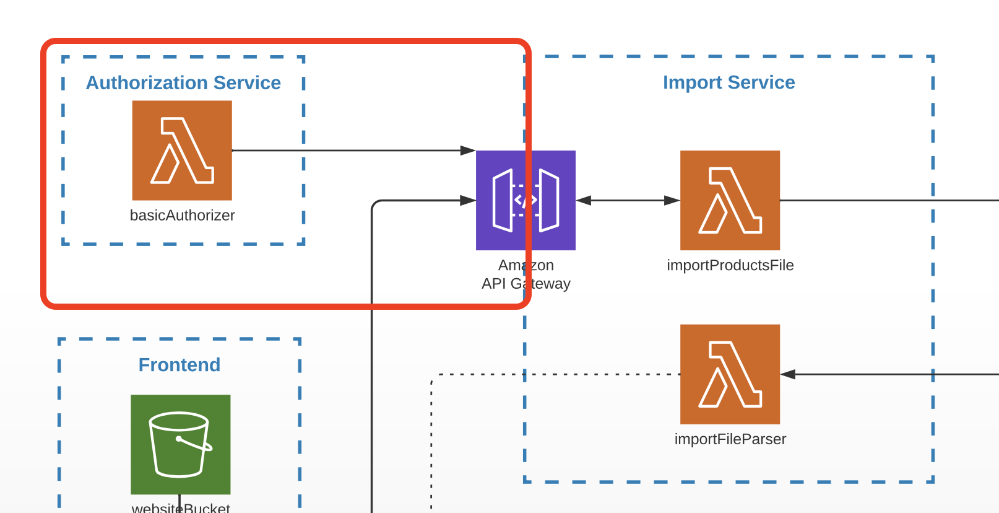

# Task 7 (Authorization)

## Prerequisites

---

- The task is a continuation of module 6 and should be done in the same repos.

## Architecture

Find the entire program architecture: [here](../Architecture.pdf).

<details>
  <summary>Task Focus</summary>

  The following image provides more info about task focus.

  

</details>

## Module Feature Flags

For this module, update your frontend flags and check off:

- [ ] `module=7`
- [ ] `security.enableBasicAuthForImport=true`
- [ ] Keep `security.enableCognito=false`
- [ ] Keep `security.requireAuthForCreatePoint=false` until module 8

## Node.js Implementation Track (Required)

- [ ] Implement `basicAuthorizer` with base64 decode and IAM policy response.
- [ ] Return `401` for missing header, `403` for invalid credentials, and allow policy for valid credentials.

Reference snippets:

- [starter_app_templates/backend_node/module_snippets.ts](../starter_app_templates/backend_node/module_snippets.ts)

## Tasks

---

### Task 7.1

1. Create a new service called `authorization-service` at the same level as Point Service and Import Service.

```
backend
├── point_service
├── import_service
└── authorization_service   <- new
```

2. Create a lambda function called `basicAuthorizer` in the Authorization Service CDK stack.
3. The lambda must read at least one environment variable in the format:

```
{your_github_login}=TEST_PASSWORD
```

- `{your_github_login}` — your GitHub account name (used as the username).
- The password must be `TEST_PASSWORD`.
- Example: `johndoe=TEST_PASSWORD`

4. The `basicAuthorizer` lambda should:
   - Decode the incoming `Authorization: Basic {token}` header (base64-encoded `username:password`).
   - Look up the decoded username in its environment variables.
   - Return a **403** IAM deny policy if credentials are wrong or the username is not found.
   - Return a **401** response if the `Authorization` header is absent.
   - Return an IAM allow policy on success ([API Gateway Lambda Authorizer docs](https://docs.aws.amazon.com/apigateway/latest/developerguide/apigateway-use-lambda-authorizer.html)).
5. Add a tiny unit test set for three scenarios: missing token, invalid token, valid token.

_NOTE: Never commit credentials to GitHub. Use a `.env` file with the `dotenv` package, and add `.env` to `.gitignore`._

### Task 7.2

1. Add the Lambda authorizer to the `GET /import` path of the Import Service API Gateway.
2. Use your `basicAuthorizer` lambda as the authorizer.

### Task 7.3

1. Update the frontend app so that requests to `GET /import` include an `Authorization: Basic {token}` header:
   - `{token}` is the base64-encoded string `{your_github_login}:TEST_PASSWORD`.
   - The frontend should read the token from `localStorage.getItem('authorization_token')`.

Deployment note for this workspace:

- Import API (module 7): `https://wtvv5f2ni0.execute-api.eu-central-1.amazonaws.com/prod`
- Set token in browser console before using Import CSV:

```js
// replace username with deployed ConfiguredAuthUser output
localStorage.setItem("authorization_token", btoa("anton_kustikov:TEST_PASSWORD"));
```

### Task 7.4

1. Commit all your work to a separate branch (e.g. `task-7`) in your own repository.
2. Create a pull request to the `main` branch.
3. Submit the link to the pull request in the Crosscheck page in [RS App](https://app.rs.school).

## Evaluation criteria (70 points for covering all criteria)

---

Provide reviewers with the repo link, the client app URL, and the `/import` API URL.

- `authorization-service` is added to the repo with the correct `basicAuthorizer` lambda and CDK stack.
- Import Service CDK stack has the authorizer configured for `importPointsFile`. Requests to `importPointsFile` work only with a valid `Authorization` header — 403 for invalid tokens, 401 for missing header.
- The client app sends the `Authorization: Basic {token}` header on import, reading the token from `localStorage`.

## Additional (optional) tasks

---

- **+30** — Frontend shows alert messages for 401 and 403 HTTP responses in the import flow.
- **Just Practice, No Evaluation** — Add a Login page and protect `getPointsList` with a Cognito Authorizer. This is a preview of module 8:
  - Create a Cognito User Pool with email as a required attribute and self-sign-up enabled.
  - Add an App Client; configure the Hosted UI callback URL pointing to your frontend.
  - Add a Cognito authorizer to `getPointsList` using `Authorization` as the token source.
  - Test: sign up, verify email, log in via Hosted UI, copy the `id_token` from the callback URL, and call `GET /points` with `Authorization: {id_token}`.
  - Remove this authorizer before submitting — it will be the focus of module 8.

## Penalties

---

- **-50** — Serverless Framework used to create and deploy infrastructure.

Acceptance template:

- [acceptance_test_templates/module_07_authorization.http](../acceptance_test_templates/module_07_authorization.http)
