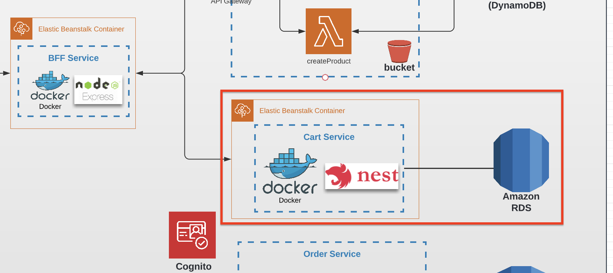

# Task 8 (User Management with Cognito)

## Prerequisites

---

- The task is a continuation of module 7 and should be done in the same repos.
- Module 7's `basicAuthorizer` remains in place; this module adds a proper Cognito-based identity layer on top.

## Architecture

Find the entire program architecture: [here](../Architecture.pdf).

<details>
  <summary>Task Focus</summary>

  The following image provides more info about task focus.

  

</details>

## Free tier note

AWS Cognito provides **50,000 Monthly Active Users for free**. This is more than sufficient for the course.

## Module Feature Flags

For this module, update your frontend flags and check off:

- [ ] `module=8`
- [ ] `security.requireAuthForCreatePoint=true`
- [ ] Keep `security.enableCognito=false` in UI until module 9 login flow is implemented

## Node.js Implementation Track (Required)

- [ ] Node.js CDK: create User Pool, App Client, Domain, trigger wiring.
- [ ] Persist one consistent user record schema.
- [ ] API protection behavior: `POST /points` protected, read routes public.

## Tasks

---

### Task 8.1 — Create a Cognito User Pool

1. Using AWS CDK, create a **Cognito User Pool** in the `authorization-service` stack with the following configuration:
   - Self sign-up enabled.
   - Required attribute: `email` (verified on sign-up).
   - Password policy: minimum 8 characters, at least 1 uppercase, 1 number.
2. Create an **App Client** for the User Pool with the following OAuth 2.0 settings:
   - Grant type: `Authorization code grant`.
   - Allowed callback URL: your CloudFront distribution URL (from module 2).
   - OAuth scopes: `email`, `openid`, `profile`.
3. Create a **Cognito Domain** (use the default Cognito-hosted domain prefix).
4. Export the User Pool ID and App Client ID as CDK stack outputs.

### Task 8.2 — Post-confirmation Lambda trigger

1. Create a lambda function called `postConfirmation` in the Authorization Service.
2. Attach it as a Cognito **Post Confirmation** trigger on the User Pool.
3. When a new user confirms their email, the lambda should write a record to a new DynamoDB table called `users`:

```
users table:
  userId    - string (Partition key — same value as Cognito sub)
  email     - string
  createdAt - string (ISO timestamp)
```

4. Add IAM permissions in the CDK stack so the lambda can write to the `users` DynamoDB table.
5. Return the incoming Cognito event object unchanged.

> **Node.js hint:** The Cognito trigger event is passed directly as the first argument. The handler must return the same event object.

### Task 8.3 — Protect Point Service with Cognito Authorizer

1. Add a **Cognito User Pool Authorizer** to the Point Service API Gateway.
2. Protect the `POST /points` endpoint so it requires a valid Cognito `id_token` in the `Authorization` header.
3. `GET /points` and `GET /points/{pointId}` should remain public.
4. Verify: call `POST /points` without a token → 401; with a valid token from a logged-in user → 201.

### Task 8.4

1. Commit all your work to a separate branch (e.g. `task-8`) in your own repository.
2. Create a pull request to the `main` branch.
3. Submit the link to the pull request in the Crosscheck page in [RS App](https://app.rs.school).

## Evaluation criteria (70 points for covering all criteria)

---

- Task 8.1 is implemented: User Pool and App Client are created via CDK; CDK stack outputs User Pool ID and App Client ID.
- Task 8.2 is implemented: confirming a new user creates a record in the `users` DynamoDB table.
- Task 8.3 is implemented: `POST /points` returns 401 without a valid Cognito token; returns 201 with a valid token.

## Additional (optional) tasks

---

- **+20** — Create a `GET /users/{userId}` endpoint that returns the user profile from DynamoDB (protected by the Cognito authorizer).
- **+10** — `postConfirmation` lambda is covered by unit tests (mock DynamoDB calls).

## Description Template for PRs

---

1. What was done?

2. Cognito User Pool ID — .....
3. App Client ID — .....
4. Link to Point Service API — .....
5. Link to Authorization Service repo — .....

Acceptance template:

- [acceptance_test_templates/module_08_cognito.http](../acceptance_test_templates/module_08_cognito.http)
