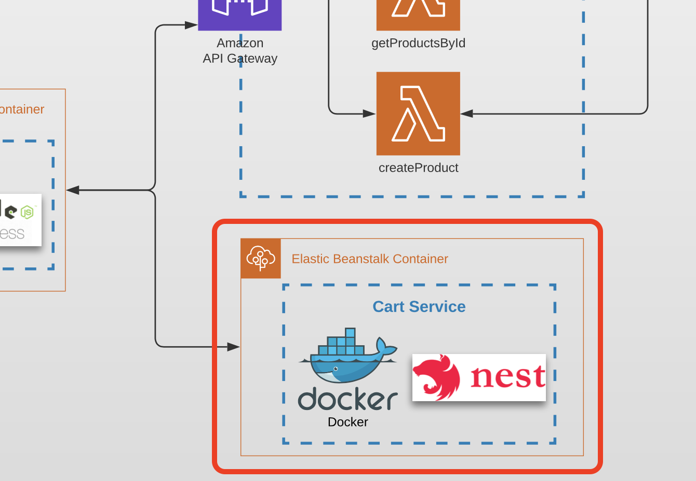

# Task 9 (Frontend Authentication with Cognito)

## Prerequisites

---

- The task is a continuation of module 8 and should be done in the same repos.
- The Cognito User Pool and App Client from module 8 must already be deployed.
- No new backend services need to be created in this module — the focus is the frontend SPA.

## Architecture

Find the entire program architecture: [here](../Architecture.pdf).

  
Task Focus

   The following image provides more info about task focus.

  

## Module Feature Flags

For this module, update your frontend flags and check off:

- [ ] `module=9`
- [ ] `security.enableCognito=true`
- [ ] `ui.enableAuthButtons=true`
- [ ] Keep `ai.enableRekognitionLabels=false` until module 10

## Tasks

---

### Task 9.1 — Login with Cognito Hosted UI

1. Add a **Login** button to the MapPoints React app.
2. Clicking the button should redirect the user to the Cognito Hosted UI login page using the App Client's OAuth 2.0 `Authorization code grant` flow.
3. After a successful login, Cognito redirects the user back to your app's callback URL with an authorization `code` in the query string.
4. Exchange the `code` for tokens by calling the Cognito `/oauth2/token` endpoint from the frontend.
5. Store the `id_token` and `access_token` in `localStorage`.

> **Resources:**
> - Cognito `/oauth2/token` endpoint: https://docs.aws.amazon.com/cognito/latest/developerguide/token-endpoint.html  
> - You can use the [amazon-cognito-identity-js](https://www.npmjs.com/package/amazon-cognito-identity-js) library or plain `fetch` calls.

### Task 9.2 — Protected UI and authenticated API calls

1. If the user is **not** logged in (no valid `id_token` in `localStorage`), the **"Add Point"** and **"Upload Photo"** buttons should be hidden or disabled.
2. If the user **is** logged in:
   - Show a "Logged in as {email}" indicator in the header (decode the `id_token` JWT to get the `email` claim).
   - Attach the `id_token` as an `Authorization` header when calling `POST /points` (which is protected in module 8).
3. Add a **Logout** button that:
   - Clears `id_token` and `access_token` from `localStorage`.
   - Redirects the user to the Cognito Hosted UI logout URL (so the Cognito session is also invalidated).

### Task 9.3

1. Commit all your work to a separate branch (e.g. `task-9`) in your own repository.
2. Create a pull request to the `main` branch.
3. Submit the link to the pull request in the Crosscheck page in [RS App](https://app.rs.school).

## Evaluation criteria (70 points for covering all criteria)

---

Provide reviewers with the CloudFront URL of your deployed app and instructions to test the login flow.

- Task 9.1 is implemented: the Login button redirects to Cognito Hosted UI; after login, `id_token` is stored in `localStorage`.
- Task 9.2 is implemented: protected UI elements are hidden for unauthenticated users; authenticated requests to `POST /points` succeed with the `id_token`.
- Task 9.3 is implemented: Logout button clears tokens and invalidates the Cognito session.

## Additional (optional) tasks

---

- **+20** — Token expiry is handled gracefully: if the `id_token` is expired, the user is redirected to the Hosted UI to log in again (use the token's `exp` claim).
- **+10** — Display user profile information (name, email) on a dedicated `/profile` page using decoded JWT claims.

## Description Template for PRs

---

1. What was done?

2. CloudFront URL of the deployed app — .....
3. Instructions to test the login/logout flow — .....
4. Link to FE PR (YOUR OWN REPOSITORY) — ...

Acceptance template:

- [acceptance_test_templates/module_09_frontend_auth_checklist.txt](../acceptance_test_templates/module_09_frontend_auth_checklist.txt)
