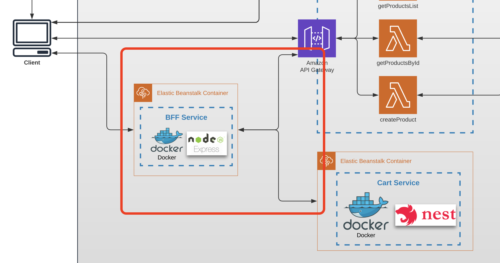

# Task 10 (AI Media Enrichment — Bonus Module)

## Prerequisites

---

- The task builds on the S3 photo upload flow from module 5.
- The Point Service and Import Service should already be deployed.
- No dependency on modules 8 or 9 — this module can be completed independently.

## Architecture

Find the entire program architecture: [here](../Architecture.pdf).

<details>
  <summary>Task Focus</summary>

  The following image provides more info about task focus.

  

</details>

## Free tier note

Amazon Rekognition provides **5,000 image analysis requests per month** for free in the first 12 months. This is more than enough for the course.

## Module Feature Flags

For this module, update your frontend flags and check off:

- [ ] `module=10`
- [ ] `ai.enableRekognitionLabels=true`
- [ ] `ui.showAiLabels=true`
- [ ] Optional: `ai.enableModeration=true`
- [ ] Optional: `ai.enableTextDetection=true`

## Node.js Implementation Track (Required)

- [ ] Implement Rekognition enrichment and persistence using AWS SDK v3.
- [ ] Output `aiLabels` in `GET /points/{pointId}` response.
- [ ] Keep confidence values as numeric values.

## Tasks

---

### Task 10.1 — Rekognition enrichment Lambda

1. In the `import-service` CDK stack, create a lambda function called `enrichPhoto`.
2. Trigger it from the same S3 `s3:ObjectCreated:*` event on the `uploads/` prefix that `processUploadedPhoto` uses (you can chain them or create a separate trigger — choose the approach that makes more sense to you).
3. The lambda should call the Amazon Rekognition `DetectLabels` API for the uploaded image:
   - Pass the S3 bucket and object key directly (no need to download the image first).
   - Request a maximum of **10 labels** with a minimum confidence of **70%**.
4. Add IAM permissions in the CDK stack so the lambda can call `rekognition:DetectLabels` and read from the S3 bucket.
5. Keep `MaxLabels=10` and `MinConfidence=70`.

> **Node.js hint:** use `@aws-sdk/client-rekognition` from AWS SDK v3.

### Task 10.2 — Store enrichment metadata in DynamoDB

1. After calling Rekognition, store the result in a new DynamoDB table called `photo_enrichment`:

```
photo_enrichment table:
  pointId     - string (Partition key)
  photoKey    - string (Sort key — the S3 object key)
  labels      - list of { name: string, confidence: number }
  enrichedAt  - string (ISO timestamp)
```

2. Add IAM permissions so the `enrichPhoto` lambda can write to `photo_enrichment`.
3. Update your CDK stack outputs to include the `photo_enrichment` table ARN.

### Task 10.3 — Expose enrichment data through the API

1. Update the `getPointById` lambda in the Point Service to also fetch the latest enrichment record for that point from `photo_enrichment` (query by `pointId`).
2. Include the labels in the API response:

```json
{
  "id": "uuid",
  "title": "Eiffel Tower",
  "latitude": 48.8584,
  "longitude": 2.2945,
  "photoUrl": "https://...",
  "aiLabels": [
    { "name": "Tower", "confidence": 99.5 },
    { "name": "Architecture", "confidence": 98.1 }
  ]
}
```

3. Display the AI labels on the point detail view in the frontend (e.g. as tags or a tooltip on the photo).

### Task 10.4

1. Commit all your work to a separate branch (e.g. `task-10`) in your own repository.
2. Create a pull request to the `main` branch.
3. Submit the link to the pull request in the Crosscheck page in [RS App](https://app.rs.school).

## Evaluation criteria (80 points for covering all criteria)

---

Provide reviewers with the following information:

- Link to the repo
- Point Service API URL
- Import Service API URL
- Example of uploading a photo and retrieving AI labels via `GET /points/{pointId}`

---

- Task 10.1 is implemented: `enrichPhoto` lambda is triggered on S3 upload and calls Rekognition `DetectLabels`.
- Task 10.2 is implemented: enrichment results are stored in the `photo_enrichment` DynamoDB table.
- Task 10.3 is implemented: `GET /points/{pointId}` returns AI labels; frontend displays them.

## Additional (optional) tasks

---

- **+20** — Also call `rekognition:DetectModerationLabels` and reject photos with unsafe content (return an error, delete the S3 object, and do not store the point photo URL).
- **+10** — `enrichPhoto` lambda is covered by unit tests (mock Rekognition and DynamoDB SDK calls).
- **+10** — Call `rekognition:DetectText` and store detected text alongside labels for points that have signage or text in their photos.

## Description Template for PRs

---

1. What was done?

2. Point Service API URL — .....
3. Import Service API URL — .....
4. Example: upload a photo then call `GET /points/{pointId}` — include the curl commands and sample response showing `aiLabels`.

Acceptance template:

- [acceptance_test_templates/module_10_ai_enrichment.http](../acceptance_test_templates/module_10_ai_enrichment.http)
